# Global Correlation Analysis: Cross-Domain Insights from World Data
This repository contains a comprehensive analytical exploration of cross-domain relationships across multiple global indicators. The project examines how socioeconomic, demographic, environmental, health, education, and geopolitical variables interact through correlation analysis and visual inspection.

The objective is to uncover high-level structural patterns, identify strong and weak relationships between domains, and provide a foundation for further modeling or statistical research.

## Contents
<details>
<summary><strong>Table of Contents</strong></summary>


- [Overview](#overview)
- [Key Findings](#key-findings)
- [Methodology](#methodology)
- [Visualization Outputs](#visualization-outputs)
- [Results Summary](#results-summary)
- [Next Steps](#next-steps)
- [Repository Structure](#repository-structure)
- [Requirements](#requirements)
- [Contact](#contact)


</details>

<a id="overview"></a>
### 1. **📊 Overview**

  This project analyzes relationships across six major domains using global data:
- Economy
- Health
- Education
- Demography
- Environment
- Geopolitics
  The analysis computes pairwise correlation matrices between every domain combination and visualizes them using annotated heatmaps. This approach highlights structural dependencies, contrasts, and unexpected weak interactions within the dataset.

<a id="key-findings"></a>
### 2. **🔍 Key Findings**

The correlation analysis reveals structural relationships across global socioeconomic, demographic, environmental, health, and geopolitical dimensions. Beyond numerical values, the patterns align with established global development theories and can be interpreted as follows:

<p align="center">
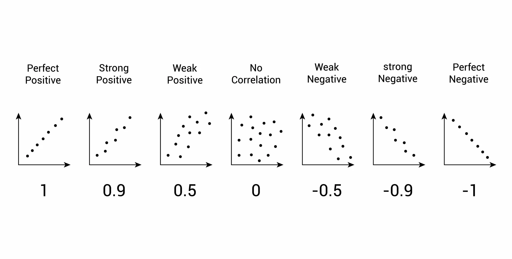
</p>

---

| Domain Pair | Relationship Strength | Key Indicators |
|-------------|------------------------|----------------|
| Education ↔ Health | Very Strong | Literacy, Life Expectancy |
| Health ↔ Demography | Strong | Birth Rate, Mortality |
| Demography ↔ Environment | Moderate–Strong | Population, CO₂ |

## **2.1 Strongest Domain Relationships**

### **Education ↔ Health (Strongest Consistency)**
The most robust and recurring pattern across all 15 matrices.

**Why this happens**
- Education increases health literacy and preventative behavior.  
- Higher educational attainment correlates with greater income and healthcare access.  
- Educated populations show lower maternal and infant mortality.  
- Strong education systems tend to co-exist with strong healthcare systems.

**Interpretation:** Education acts as an upstream driver of long-term health outcomes.

---

### **Health ↔ Demography (High-Intensity Correlations)**
A cluster tightly connecting fertility, birth rate, mortality, and life expectancy.

**Why this happens**
- Early demographic transition → high fertility and high mortality.
- Limited healthcare infrastructure disproportionately affects maternal and infant outcomes.
- As demographic pressure decreases, life expectancy improves.

---

### **Demography ↔ Environment**
Population and urban population strongly correlate with CO₂ emissions.

**Why this happens**
- Higher population increases total energy demand.
- Urbanization intensifies transportation use, industrial activity, and pollution.
- Environmental pressure is primarily a scale phenomenon.

---

### **Environment ↔ Geopolitics**
Moderate correlations between emissions and land area / military size.

**Why this happens**
- Larger countries typically have larger populations and industrial bases.
- Military size often correlates with national scale.

---

### **Economy ↔ Other Domains (Weakest Set of Correlations)**
Most economic indicators—CPI, unemployment, tax revenue—show weak correlations with Education and Health.

**Why this happens**
- These variables are short-term and policy-driven.
- They do not capture structural development (e.g., productivity, inequality).
- GDP is the only economic metric with strong cross-domain impacts (emissions, population scale).

---

## **2.2 Strengths of This Analysis**

- Clear interpretability through correlation matrices and heatmaps.  
- Comprehensive cross-domain coverage (15 pairs).  
- Consistency across development-related clusters.  
- Alignment with demographic transition theory and global development literature.  
- Effective for hypothesis generation and exploratory modeling.

---

## **2.3 Limitations and Weaknesses**

- Correlation does not imply causation (directionality not established).  
- Scale effects (population, GDP, land area) may inflate correlations.  
- Economic indicators selected are short-term and volatile.  
- Data quality varies across countries (missing values, measurement differences).  
- Pearson correlation only captures linear relationships.

---

## **2.4 Recommendations for Future Analysis**

- Add structural economic indicators (GDP per capita, GINI, HDI).  
- Normalize scale-heavy indicators (log-transform population and emissions).  
- Apply PCA to capture latent global development dimensions.  
- Perform clustering to classify countries into development archetypes.  
- Explore non-linear relationships using Spearman or Kendall correlation.  
- Use causal inference methods (SEM, DAGs, regressions) to explore directionality.

---

**Key takeaway:**  
Global development follows a clear structural axis—**Education → Health → Demography**—with environmental impact driven largely by population scale. Economic indicators in this dataset have limited explanatory power except for GDP.
  
<a id="methodology"></a>
### 3. **🧪 Methodology**

  **Data Preparation**
- Filtering for numeric variables
- Type normalization (e.g., handling thousands separators, numeric strings)
- Validation of integer-based indices
  
  **Computation**
- Domain-level grouping of indicators
- Cross-domain matrix generation using pairwise combinations
- Selection of valid numeric columns per domain before correlation

  **Visualization**
- Annotated heatmaps using a custom plotting function
- Consistent color scaling between -1 and +1
- Labeling for easy interpretation

<a id="visualization-outputs"></a>
### 4. **📈 Visualization Outputs**

The repository includes 15 heatmaps covering all combinations of:
- Economy
- Health
- Education
- Demography
- Environment
- Geopolitics

Each figure includes:
- Correlation values displayed inside each cell
- Uniform color scale
- Clear labeling of rows and columns
- Automated sizing for readability

## 📸 Heatmap Gallery

### **Economy Correlations**
<p align="center">
  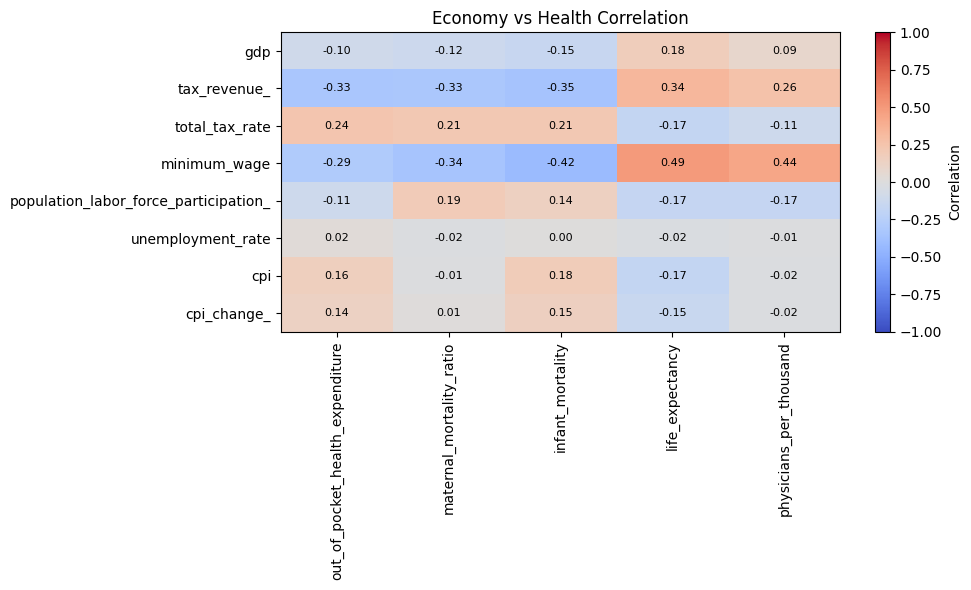
  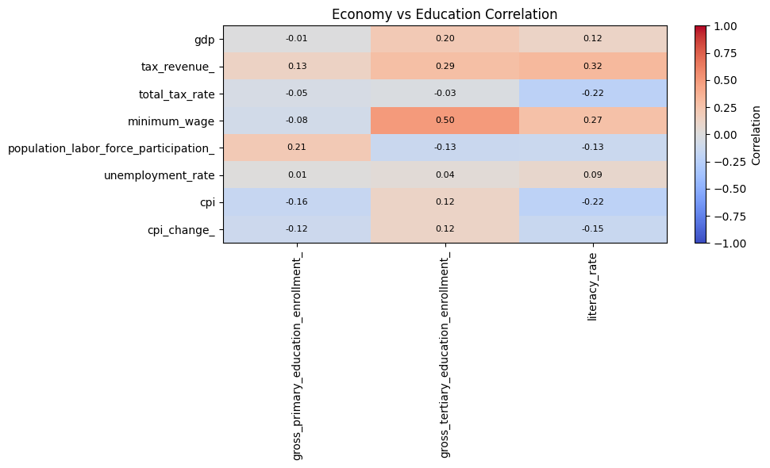
  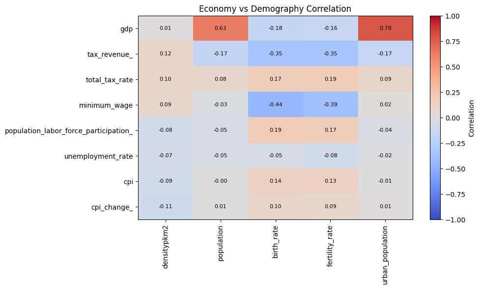
</p>

<p align="center">
  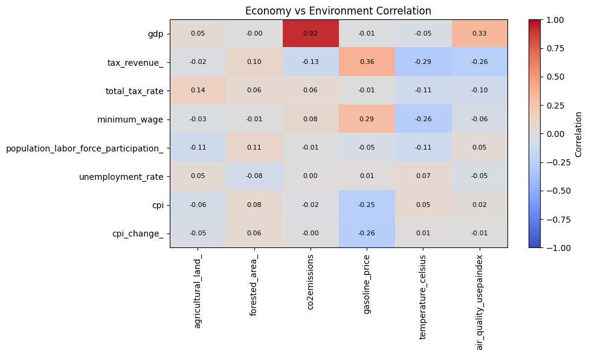
  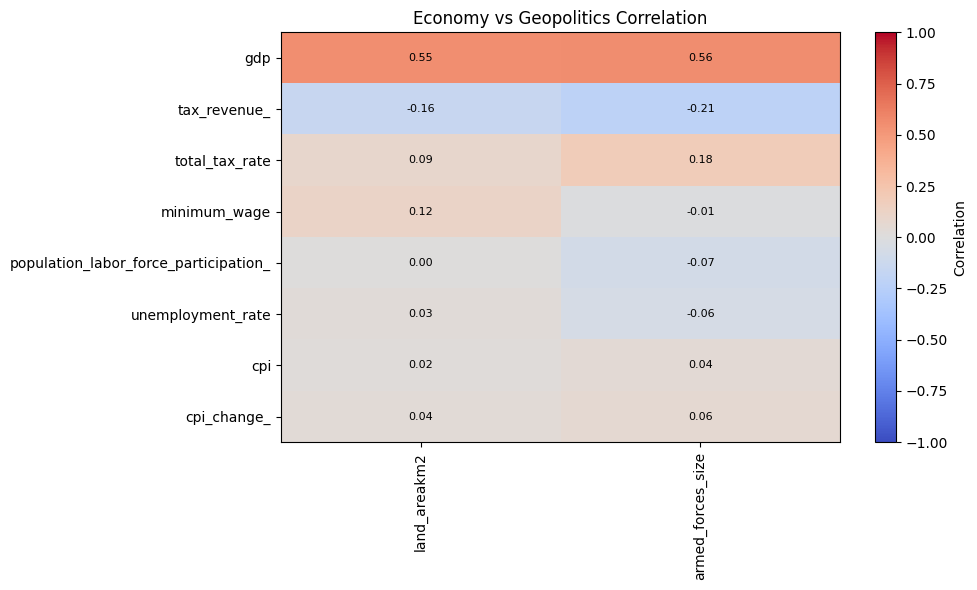
</p>

---

### **Health Correlations**
<p align="center">
  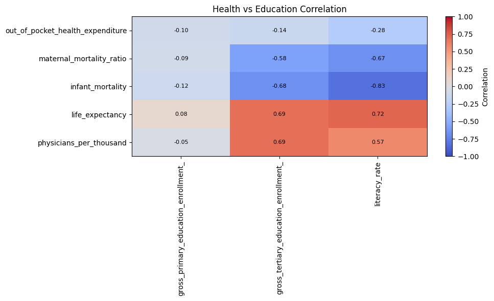
  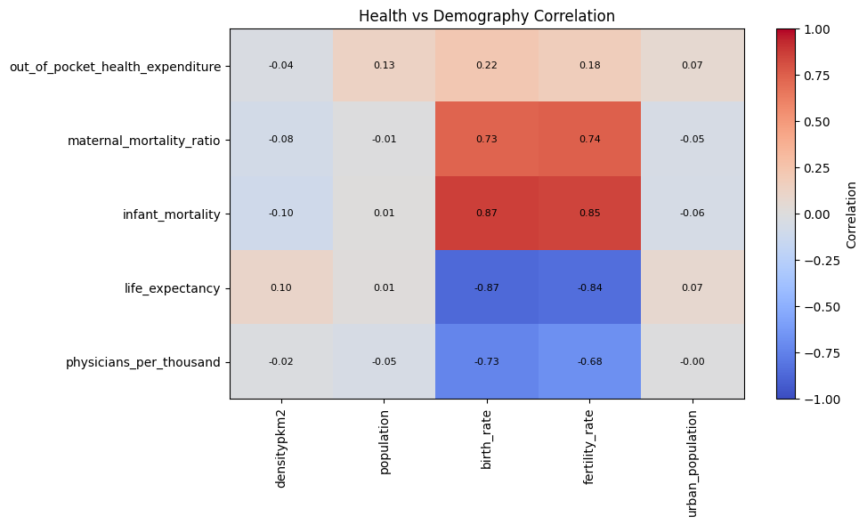
  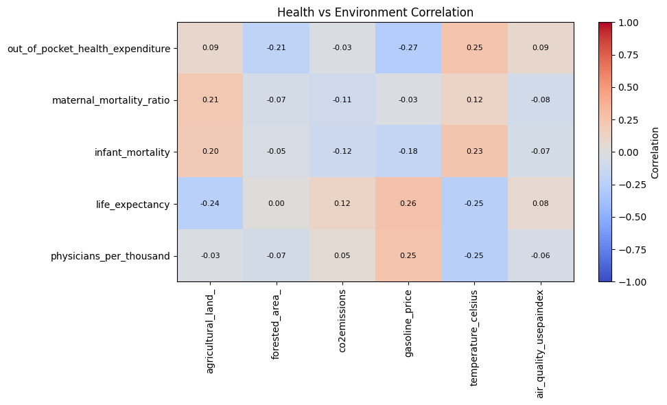
</p>

<p align="center">
  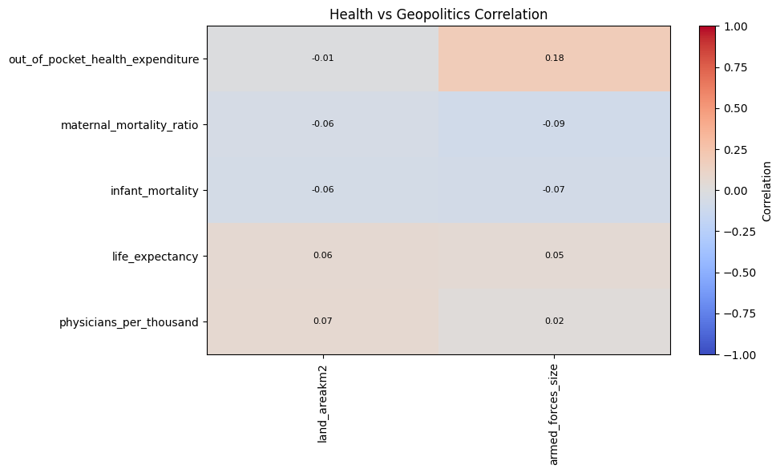
</p>

---

### **Education Correlations**
<p align="center">
  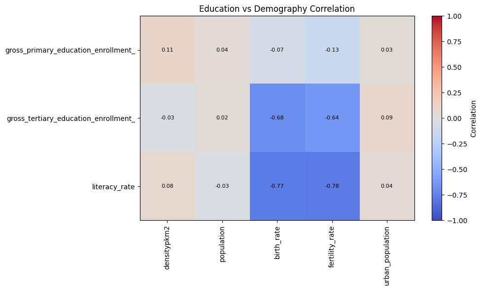
  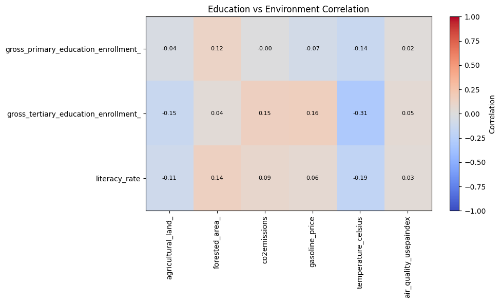
  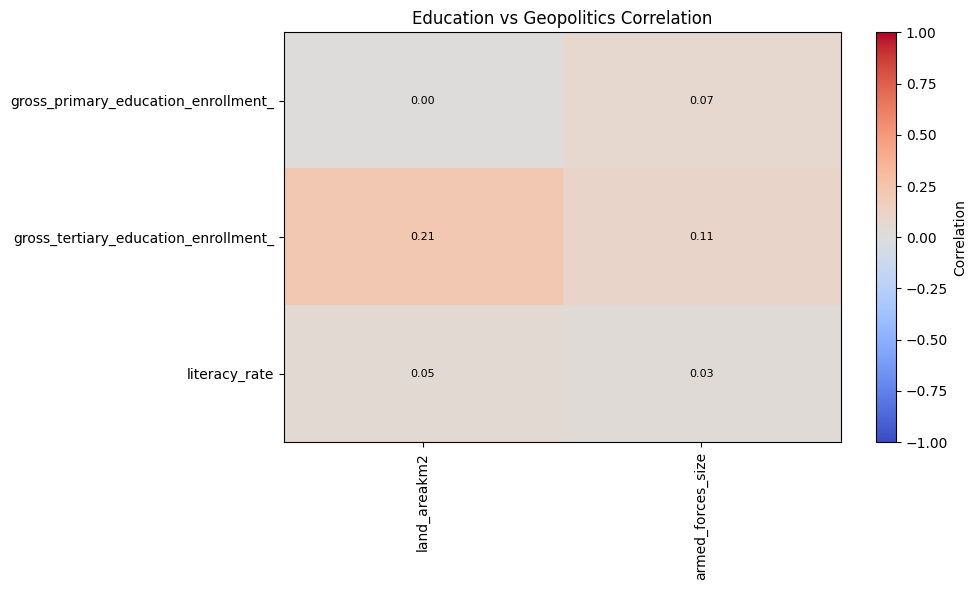
</p>

---

### **Demography Correlations**
<p align="center">
  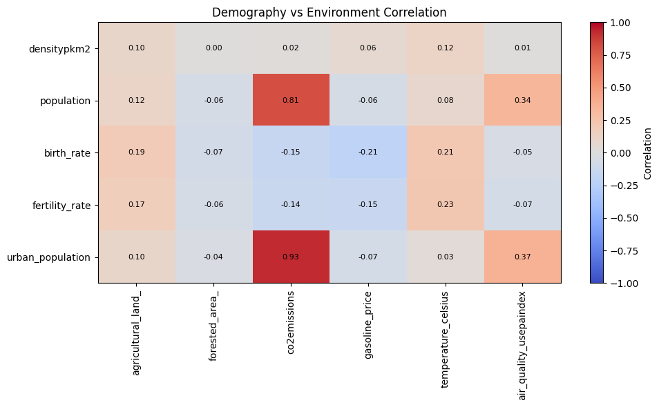
  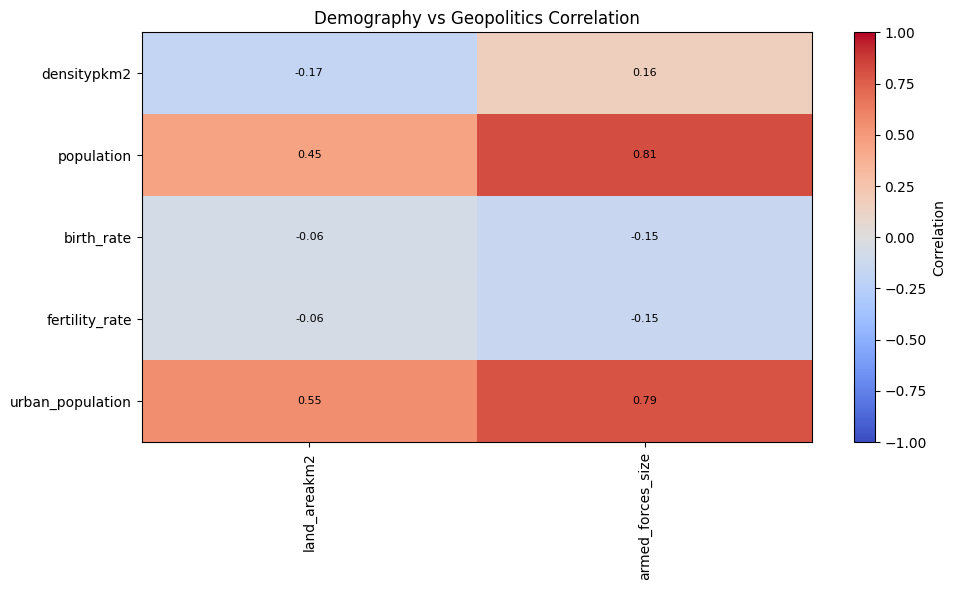
</p>

---

### **Environment ↔ Geopolitics**
<p align="center">
  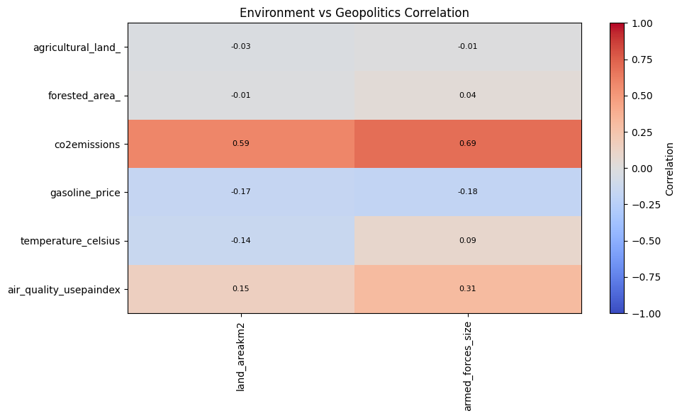
</p>

### 5. **📌 Results Summary**

Key global drivers identified across domains:
- Life expectancy
- Infant and maternal mortality
- Literacy rate
- Tertiary education enrollment
- CO₂ emissions
- Urban population
- **GDP** (most influential economic indicator)

Weak or inconsistent drivers:
- CPI
- CPI change
- Tax revenue
- Forested area
- Unemployment rate

A compact final summary table is available within the notebook.

<a id="next-steps"></a>
### 6. **🚀 Next Steps**

A. **Enhanced Metrics**

Introduce structural economic variables such as:
- GDP per capita
- GINI index
- HDI
- Productivity metrics

B. **Normalization & Scaling**
- Per-capita transformations
- Log scaling for poly-distributed variables (population, emissions)
- Standardization (z-scores)

C. **Advanced Modeling**
- PCA (Principal Component Analysis)
- Cluster analysis (k-means, hierarchical)
- Outlier detection
- Factor models

D. **Composite Index Construction**
Develop a cross-domain index summarizing multi-dimensional development.

<a id="repository-structure"></a>
### 7. **📁 Repository Structure**

```
.
├── data/
│   ├── raw/            # Original datasets
│   ├── processed/      # Cleaned and standardized datasets
│
├── notebooks/
│   └── Global_Correlation_Analysis.ipynb
│
├── visuals/
│   └── heatmaps/       # All correlation heatmap images
│
├── src/
│   ├── preprocessing/  # Data cleaning modules
│   ├── analysis/       # Correlation and numeric processing
│   ├── visualization/  # Heatmap and plotting utilities
│   └── utils/          # Supporting helper functions
│
└── README.md

```

<a id="requirements"></a>
### 8. **📦 Requirements**

You may include a separate requirements.txt, but key dependencies typically include:

- pandas
- numpy
- matplotlib
- itertools
- seaborn
- jupyter

<a id="contact"></a>
### 9. **📨 Contact**

If you want enhancements, dashboards, or an extended statistical report, feel free to reach out or open an issue.
Gmail: *aacccasanic@gmail.com*

